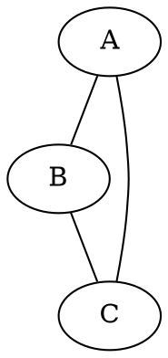
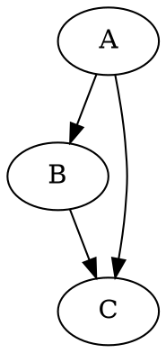
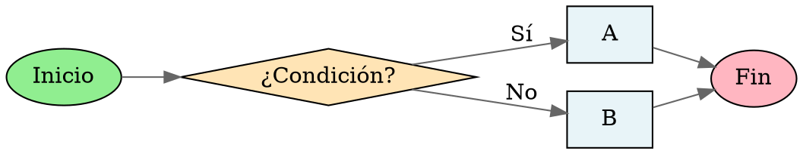

# Skill: Crear Documentos

> ⚠️ REGLA ABSOLUTA — NOTACIÓN MATEMÁTICA
> Si el documento contiene matemáticas, usa símbolos Unicode (λ, ∀, ∈, ≤, ∎) — NUNCA `$...$` ni `$$...$$` en tus mensajes de chat.
> La excepción es el contenido DENTRO de archivos `.tex`, donde LaTeX es obligatorio y correcto.

Generás el contenido completo del documento y lo escribís en disco usando bash. El usuario recibe un archivo listo para usar.

---

## Paso 1: Identificar qué crear

Preguntá si no está claro:

1. **¿Qué tipo de archivo?** — Word (.docx), LaTeX (.tex), o Graphviz (.dot)
2. **¿Cuál es el contenido?** — Título, secciones, texto, tablas, fórmulas, etc.
3. **¿Dónde guardarlo?** — Ruta de destino. Si no dice, usá el directorio actual.

---

## Formato: Word (.docx)

Un `.docx` es un ZIP con XML adentro. Generás los archivos XML mínimos y los ensamblás con `zip`.

### Estructura mínima obligatoria

```
documento.docx (ZIP)
├── [Content_Types].xml
├── _rels/
│   └── .rels
└── word/
    ├── document.xml       ← el contenido real
    ├── styles.xml         ← estilos básicos
    └── _rels/
        └── document.xml.rels
```

### Proceso de creación

```bash
# 1. Crear estructura de directorios en /tmp
mkdir -p /tmp/docx_build/word/_rels
mkdir -p /tmp/docx_build/_rels

# 2. Escribir cada archivo XML (ver plantillas abajo)

# 3. Ensamblar como ZIP con extensión .docx
cd /tmp/docx_build
zip -r ~/ruta/al/documento.docx . -x "*.DS_Store"

# 4. Limpiar
rm -rf /tmp/docx_build
```

### Plantilla: `[Content_Types].xml`

```xml
<?xml version="1.0" encoding="UTF-8" standalone="yes"?>
<Types xmlns="http://schemas.openxmlformats.org/package/2006/content-types">
  <Default Extension="rels" ContentType="application/vnd.openxmlformats-package.relationships+xml"/>
  <Default Extension="xml" ContentType="application/xml"/>
  <Override PartName="/word/document.xml"
    ContentType="application/vnd.openxmlformats-officedocument.wordprocessingml.document.main+xml"/>
  <Override PartName="/word/styles.xml"
    ContentType="application/vnd.openxmlformats-officedocument.wordprocessingml.styles+xml"/>
</Types>
```

### Plantilla: `_rels/.rels`

```xml
<?xml version="1.0" encoding="UTF-8" standalone="yes"?>
<Relationships xmlns="http://schemas.openxmlformats.org/package/2006/relationships">
  <Relationship Id="rId1"
    Type="http://schemas.openxmlformats.org/officeDocument/2006/relationships/officeDocument"
    Target="word/document.xml"/>
</Relationships>
```

### Plantilla: `word/_rels/document.xml.rels`

```xml
<?xml version="1.0" encoding="UTF-8" standalone="yes"?>
<Relationships xmlns="http://schemas.openxmlformats.org/package/2006/relationships">
  <Relationship Id="rId1"
    Type="http://schemas.openxmlformats.org/officeDocument/2006/relationships/styles"
    Target="styles.xml"/>
</Relationships>
```

### Plantilla: `word/styles.xml`

```xml
<?xml version="1.0" encoding="UTF-8" standalone="yes"?>
<w:styles xmlns:w="http://schemas.openxmlformats.org/wordprocessingml/2006/main">
  <w:style w:type="paragraph" w:styleId="Normal" w:default="1">
    <w:name w:val="Normal"/>
    <w:rPr>
      <w:sz w:val="24"/>
      <w:lang w:val="es-AR"/>
    </w:rPr>
  </w:style>
  <w:style w:type="paragraph" w:styleId="Heading1">
    <w:name w:val="heading 1"/>
    <w:basedOn w:val="Normal"/>
    <w:pPr>
      <w:outlineLvl w:val="0"/>
    </w:pPr>
    <w:rPr>
      <w:b/>
      <w:sz w:val="36"/>
    </w:rPr>
  </w:style>
  <w:style w:type="paragraph" w:styleId="Heading2">
    <w:name w:val="heading 2"/>
    <w:basedOn w:val="Normal"/>
    <w:pPr>
      <w:outlineLvl w:val="1"/>
    </w:pPr>
    <w:rPr>
      <w:b/>
      <w:sz w:val="28"/>
    </w:rPr>
  </w:style>
</w:styles>
```

### Plantilla: `word/document.xml`

Usá estos bloques XML según el contenido:

**Párrafo normal:**
```xml
<w:p>
  <w:r>
    <w:t xml:space="preserve">Texto del párrafo aquí.</w:t>
  </w:r>
</w:p>
```

**Título (Heading 1):**
```xml
<w:p>
  <w:pPr><w:pStyle w:val="Heading1"/></w:pPr>
  <w:r><w:t>Título del documento</w:t></w:r>
</w:p>
```

**Sección (Heading 2):**
```xml
<w:p>
  <w:pPr><w:pStyle w:val="Heading2"/></w:pPr>
  <w:r><w:t>Nombre de la sección</w:t></w:r>
</w:p>
```

**Texto en negrita:**
```xml
<w:r>
  <w:rPr><w:b/></w:rPr>
  <w:t>Texto en negrita</w:t>
</w:r>
```

**Texto en cursiva:**
```xml
<w:r>
  <w:rPr><w:i/></w:rPr>
  <w:t>Texto en cursiva</w:t>
</w:r>
```

**Ítem de lista (bullet):**
```xml
<w:p>
  <w:pPr>
    <w:numPr>
      <w:ilvl w:val="0"/>
      <w:numId w:val="1"/>
    </w:numPr>
  </w:pPr>
  <w:r><w:t>Elemento de la lista</w:t></w:r>
</w:p>
```

**Estructura completa de `document.xml`:**
```xml
<?xml version="1.0" encoding="UTF-8" standalone="yes"?>
<w:document xmlns:w="http://schemas.openxmlformats.org/wordprocessingml/2006/main">
  <w:body>
    <!-- tus párrafos acá -->
    <w:sectPr>
      <w:pgSz w:w="12240" w:h="15840"/>
      <w:pgMar w:top="1440" w:right="1440" w:bottom="1440" w:left="1440"/>
    </w:sectPr>
  </w:body>
</w:document>
```

### Caracteres especiales en XML

Escapá siempre estos caracteres dentro de `<w:t>`:

| Carácter | Escape |
|---|---|
| `&` | `&amp;` |
| `<` | `&lt;` |
| `>` | `&gt;` |
| `"` | `&quot;` |

---

## Formato: LaTeX (.tex)

Generás el archivo `.tex` directamente — es texto plano.

### Plantilla base

```latex
\documentclass[12pt,a4paper]{article}
\usepackage[utf8]{inputenc}
\usepackage[T1]{fontenc}
\usepackage[spanish]{babel}
\usepackage{amsmath, amssymb, amsthm}
\usepackage{geometry}
\geometry{margin=2.5cm}

\title{Título del Documento}
\author{Autor}
\date{\today}

\begin{document}

\maketitle
\tableofcontents
\newpage

\section{Introducción}
Texto aquí.

\section{Desarrollo}
Texto aquí.

\end{document}
```

### Creación con bash

```bash
cat > ~/ruta/documento.tex << 'EOF'
[contenido LaTeX aquí]
EOF
```

### Elementos comunes

**Fórmula inline:** `$f(x) = x^2$`
**Fórmula en bloque:**
```latex
\[
  \int_a^b f(x)\,dx = F(b) - F(a)
\]
```

**Teorema:**
```latex
\newtheorem{teorema}{Teorema}
\begin{teorema}
  Enunciado del teorema.
\end{teorema}
\begin{proof}
  Demostración.
\end{proof}
```

**Tabla:**
```latex
\begin{tabular}{|l|c|r|}
  \hline
  Columna 1 & Columna 2 & Columna 3 \\
  \hline
  dato & dato & dato \\
  \hline
\end{tabular}
```

---

## Formato: Graphviz (.dot)

Generás el archivo `.dot` directamente — es texto plano.

### Tipos de grafo

**Grafo no dirigido:**


**Grafo dirigido:**


### Atributos útiles



### Creación con bash

```bash
cat > ~/ruta/diagrama.dot << 'EOF'
[contenido DOT aquí]
EOF

# Opcional: renderizar a PNG si graphviz está instalado
dot -Tpng ~/ruta/diagrama.dot -o ~/ruta/diagrama.png
```

### Formas de nodo comunes

| Shape | Uso típico |
|---|---|
| `box` | Proceso, paso |
| `oval` / `ellipse` | Inicio / fin |
| `diamond` | Decisión |
| `parallelogram` | Entrada / salida |
| `cylinder` | Base de datos |
| `note` | Comentario |

---

## Reglas generales

- Siempre confirmá la ruta de destino antes de escribir.
- Si el archivo ya existe, avisá antes de sobreescribir.
- Después de crear el archivo, mostrá cómo abrirlo o compilarlo:
  - `.docx` → `libreoffice documento.docx` o abrir con Word
  - `.tex` → `pdflatex documento.tex`
  - `.dot` → `dot -Tpdf diagrama.dot -o diagrama.pdf`
- Si el contenido del documento incluye matemáticas, usá el formato LaTeX para `.tex` y texto plano con Unicode para `.docx` y `.dot`.
